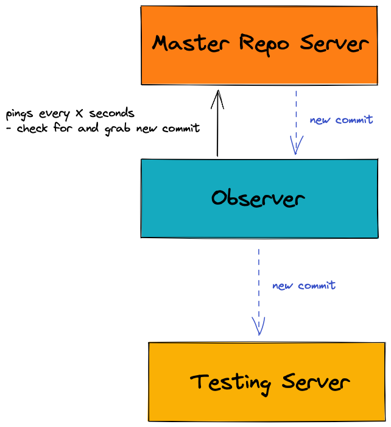

## Preview notes
**Problem definition**: Testing new code changes in a distributed, accurately and robust manner to ensure the changes will not break production servers.

#### Design considerations
* **Accuracy** - this system should be able to consistently determine whether a commit will or will not break tests
* **Robustness** - if failures occurs, the system should be able to recover and continue testing new commits
* **Efficiency** - the system must be able to handle many commits at once to avoid being a bottleneck in the push process

#### Design constraints
* **Efficiency** - handle high load well
* **Be fast** - quickly return tests results

#### My architecture diagram

## Reading notes
#### Overview
* There are three primary components: an observer, a test job dispatcher and a test runner
  * Why is the observer and test job dispatcher not under one component?
  * A **naive system** is to put all components on a single machine, but then there will be no
    * fault-tolerance (test can't run if any components fails)
    * load handling (number of test runners is limited by machine's number of cores)
  * The **ideal system** should handle as many test jobs as requested and compensate when a machine goes down. 
    * Therefore, the components are separate process so we can spawn many instances of a test runner or turn on new machines for the observer and dispatcher if they happen to fail.
    * The components communicate through sockets b/c they are separate processes.

#### Repository Observer
* Job: monitors a repo and notifies the dispatcher when a new commit is seen
* To make the code simpler, only the latest commit is to be tested (most systems test each new commit)
* Before sending the most recent commit, it checks the dispatcher server's status
  * Here we'll know if we need to try communicating with the dispatcher again in 5 seconds

#### Dispatcher
* Job: receive new commit from Observer (via \dispatch) and delegates them to test runners
  * Runner-checker: Checks if each runner is still alive periodically otherwise the task of the dead runner needs to be redistributed
  * Redistribute: Handles any errors from test runners by re-excuting the task on another runner
* Test runners will register themselves with the Dispatcher (via \register)
* It's multi-threaded
  * One thread for checking the runners
  * Another thread for redistributing tasks
  * Spawning threads as needed to handle connections from the Dispatcher and Runners
    * A single thread would only allow for one connection at a time

#### Test Runner
* Job: receive commit-id from Dispatcher and reports tests results (via \results)
* Periodically checks if the Dispatcher is up, if not then the runner is shutdown (to conserve resources)
* It's multi-threaded
  * One thread to check the dispatcher
  * Another thread to receive and test commit-id from Dispatcher
    * Maintain a state that flags whether a testing is in-progress.
  * Another thread to handle checkup ping from Dispatcher
  * An alternative is to have the Dispatcher keep the connection alive with each test runner but this is memory intensive and vulnerable to dropped connections

#### Requirement statisfaction
* **Accuracy** - Runner's repo is set to received commit-id and UnitTests are ran to determine breakage potential
* **Robustness** - Dispatcher periodically checks for dead runners and redistribute tasks if needed
* **Efficiency** - Dispatcher and Test Runner are multi-threaded TCP servers that can handle many requests at once
  * Dispatcher can handle high load by spawning threads to receive commit-ids from Observer and immediately dispatching the commit-id to a Test Runner
  * We can easily scale the number of Test Runners to handle more commits when needed
* **Be fast** - Dispatcher and Test Runner are mulit-threaded TCP servers that serve connections immediately.
  * Test runner receives and tests commit-id and return results on its own thread, while other threads handle ping requests. 

#### Control flow diagram

