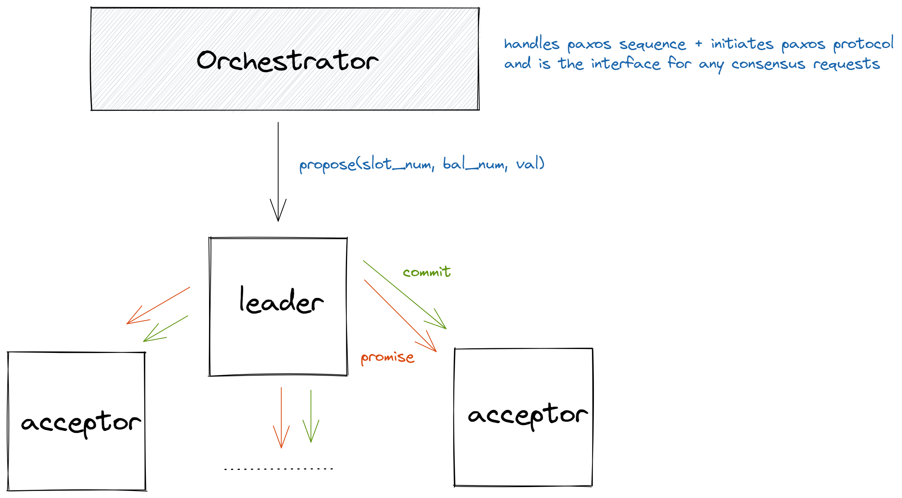

## Preview notes
**Problem definition**: Implementing a protocol to support reliable computation on a distributed system. With a concrete example, if you transfer money to another person and the server hosting your account withdrew the money but the server hosting the other account failed then this is unreliable.

#### Design considerations
* **Reliability** - the system should be able to avoid computation failures as much as possible throughout its lifespan
* **Accuracy** - the should should be able to execute the computation perfectly
* **Correctness** - the system should always behave as intended in the specifications
* **Adaptability** - we should be able to extend the system with more hardware
* **Robustness** - handle node failures

#### Design constraints
* **Reliability** - failures must be prevented 
* **Correctness** - the system must adhere to its specifications
* **Adaptability** - add more hardware with minimal code changes

#### My architecture diagram

## Reading notes
##### Deterministic State Machines
* If servers use local state to perform operations then there can be race conditions. 
* The solution is to use a **distributed deterministic state machine**.

#### Consensus by Paxos
* Simple Paxos (or Synod protocol): a way for servers to agree on a single value
  * Guarantees that there will be no conflicts on a consensus since it's a distributed state machine 
* Multi-Paxos: a way for servers to agree on a numbered sequence of values, one at a time.

#### Component Model
* Cluster nodes are represented as a node class
* Each node can have roles added or removed throughout the process
* Roles:
* Local replica
  * Job: assign new proposals to a slot, update local state machine, track current leader, add new nodes to cluster
  * holds a local state machine that is in sync with the distributed state machine; midde man between API and cluster
  * since slots are processed in order, no-op proposals are used when there's no proposal and no decision for the current slot  
* Leader
 * Job: request new ballots and generate a decision, also delegates to scout and commander roles for the two portions of the protocol
* Scout
 * Job: sends _prepare()_ and receives _promise()_ for the Leader
 * communicates back with the Leader when its promise is accepted or rejected
* Commander
 * Job: sends _accept()_ and receives _accepted()_ for the Leader
 * communicates back with the Leader when its proposal is accepted or rejected
 * broadcasts a decision message to all nodes when the proposal is accepted; decision is handled by Local replica
* Bootstrap
 * Job: initialize Replica and Leader roles when node is accepted to cluster
* Seed
 * Job: a single node will start the cluster by accepting its peers as Bootstrap nodes, then later convert itself to a Boostrap node 
* Requester
 * Job: handles requests to the cluster; sends _invoke()_ messages to the local replica

#### Application Interface
* A _Member_ object is created for each cluster member which provides an application-specific state machine and a list of peers
* The member object can have a bootstrap role if it's joining an existing cluster or seed role if it's creating a new cluster
* The application interacts with the cluster via _invoke()_ to kick off a proposal for a state transition
 * _invoke()_ returns the consensus output and a **synchronized** Queue waits for the results (synchronized ensures sequence order)

#### Requirement satisfaction
* **Accuracy** - a Deterministic State Machine will always produce the same output given the same input
* **Correctness** - use structural code to test the system's correspondence to the specification 
 * Complex protocols (such as Multi-Paxos) can exhibit complex failures, so support is included for reproducing and debugging rare failures
  * a logger used for debugging 
  * assertions will catch errors early
  * enforcing message types to ensure the interface between nodes is correct
  * fuzz testing is running tests with random inputs into something breaks
  * network simulation can be done offline
 * Using OOP to break the cluster down into handful of classes which all extend the _Role_ subclass
* **Robustness** - there's a timeout for leader failures and retransmission for each node-to-node operation in the protocol 
* **Adaptability** - including a Bootstrap role that interacts with the Replica can scale the number of nodes in the cluster
* **Reliability** - failures are detected with a heartbeat protocol and leader election are done ASAP to avoid conflicts
